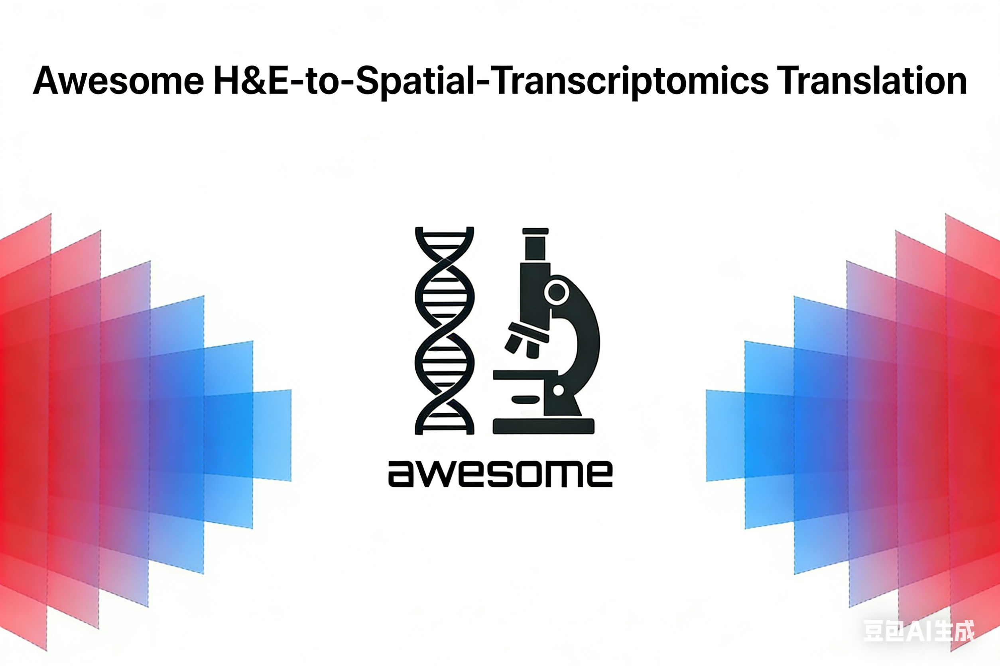

# Awesome H&E-to-Spatial-Transcriptomics Translation
 
 

 <!-- omit in toc -->
 

A curated collection of works on translating hematoxylin and eosin (H&E) stained histopathology images into spatial transcriptomics.  
This repository includes **papers, code, and datasets**, and focuses exclusively on **generative translation from H&E images to spatially resolved gene expression**.

---

## 📌 Introduction
Spatial transcriptomics provides spatially resolved gene expression profiles, while H&E staining is one of the most common and cost-effective histopathology techniques.  
Recent advances in machine learning and generative modeling have enabled the translation of H&E images into spatial gene expression, bridging the gap between routine pathology and spatial omics.  

This repository aims to collect and organize resources in this direction to facilitate research and applications.

## 📋 Table of Contents

<!-- - [📊 Datasets](#📊-datasets) -->
- [📚 Papers](#📚-papers)
  - [Protocol, Benchmark and Survey](#protocol-benchmark-and-survey)
  - [H&E To Spatial Transcriptomics](#h&e-to-spatial-transcriptomics)
    - [2025](#2025)
    - [2024](#2024)
    - [2023 and Earlier](#2023-and-earlier)
  - [H&E To Gene Mutation](#h&e-to-gene-mutation)
- [🤝 Contributing](#🤝-contributing)
- [📧 Contact](#📧-contact)
- [🙏 Acknowledgments](#🙏-acknowledgments)

<!-- ## 📊 Datasets -->

<!-- 

📊 Datasets

### Public Datasets
| Year | Title                                                        |  Venue  |        Built For        |                            Paper                             |                             Code                             |
| ---- | ------------------------------------------------------------ | :-----: | :-------------------: | :----------------------------------------------------------: | :----------------------------------------------------------: | -->
<!-- | 2023 | **An AI-ready multiplex staining dataset for reproducible and accurate characterization of tumor immune microenvironment** | MICCAI | H&E To Protein | [link](https://arxiv.org/abs/2305.16465)    | [link](https://github.com/nadeemlab/DeepLIIF)                   | -->

## 📚 Papers
### Protocol, Benchmark and Survey
| Year | Title                                                        |  Venue  |        Field        |                            Paper                             |
| ---- | ------------------------------------------------------------ | :-----: | :-------------------: | :----------------------------------------------------------: |
| 2025 | **Benchmarking the translational potential of spatial gene expression prediction from histology** | Nat. Commun. |  Benchmark | [link](https://www.nature.com/articles/s41467-025-56618-y)    |
| 2025 | **Combining spatial transcriptomics with tissue morphology** | Nat. Commun. |  Survey | [link](https://www.nature.com/articles/s41467-025-58989-8)    |
| 2025 | **Generative Models in Computational Pathology: A Comprehensive Survey on Methods, Applications, and Challenges** | arXiv |  Survey | [link](https://arxiv.org/abs/2505.10993)    |
| 2024 | **From whole-slide image to biomarker prediction: end-to-end weakly supervised deep learning in computational pathology** | Nat. Protoc. |  Protocol | [link](https://www.nature.com/articles/s41596-024-01047-2)    |
<!-- | 2022 | **Deep learning-based prediction of molecular tumor biomarkers from H&E: A practical review** | J. Pers. Med | H&E To Protein | [link](https://www.mdpi.com/2075-4426/12/12/2022)    | -->

<!-- ### H&E To Cell profile
| Year | Title                                                        |  Venue  |        Method        |                            Paper                             |                             Code                             |
| ---- | ------------------------------------------------------------ | :-----: | :-------------------: | :----------------------------------------------------------: | :----------------------------------------------------------: |
| 2025 | **Systematic inference of super-resolution cell spatial profiles from histology images** | Nat. Commun. | HistoCell | [link](https://www.nature.com/articles/s41467-025-57072-6)    | [link](https://github.com/recolyce/HistoCell)  -->

### H&E To Spatial Transcriptomics
#### 🟪 2026

| Year | Title | Venue | Method | Paper | Code |
| ---- | ----- | :---: | :----: | :---: | :--: |
| 2025 | **TBD** |  |  | [link]() | [link]() |
| 2026 | **sCellST predicts single-cell gene expression from H&E images** | Nat. Commun. | sCellST | [link](https://doi.org/10.1038/s41467-025-67965-1) | [link](https://github.com/loicchadoutaud/sCellST) |

#### 🟦 2025

| Year | Title | Venue | Method | Paper | Code |
| ---- | ----- | :---: | :----: | :---: | :--: |
| 2025 | **High-parameter spatial multi-omics through histology-anchored integration** | Nat. Methods |  SpatialEx | [link](https://doi.org/10.1038/s41592-025-02926-6) | [link](https://github.com/KEAML-JLU/SpatialEx) |
| 2025 | **Generating crossmodal gene expression from cancer histopathology improves multimodal AI predictions** | Nat. Commun. | PathGen | [link](https://doi.org/10.1038/s41467-025-66961-9) | [link](https://github.com/Samiran-Dey/PathGen) |
| 2025 | **HyperST: Hierarchical Hyperbolic Learning for Spatial Transcriptomics Prediction** | arXriv | HyperST | [link](https://arxiv.org/abs/2511.22107) | - |
| 2025 | **STPath: a generative foundation model for integrating spatial transcriptomics and whole-slide images** | npj Digit. Med. | STPath | [link](https://www.nature.com/articles/s41746-025-02020-3) | [link](https://github.com/Graph-and-Geometric-Learning/STPath) |
| 2025 | **A deep learning-based multiscale integration of spatial omics with tumor morphology** | Nat. Commun. | MISO | [link](https://www.nature.com/articles/s41467-025-66691-y) | [link](https://github.com/owkin/miso_code) |
| 2025 | **GenAR: Next-Scale Autoregressive Generation for Spatial Gene Expression Prediction** | arXiv | GenAR | [link](https://arxiv.org/abs/2510.04315v1) | [link](https://github.com/oyjr/genar) |
| 2025 | **stImage: a versatile framework for optimizing spatial transcriptomic analysis through customizable deep histology and location informed integration** | Brief. Bioinform. | stImage | [link](https://academic.oup.com/article/26/5/bbaf429/8247981) | [link](https://github.com/YuWang-VUMC/stImage) |
| 2025 | **Scaling up spatial transcriptomics for large-sized tissues: uncovering cellular-level tissue architecture beyond conventional platforms with iSCALE** | Nat. Methods | iSCALE | [link](https://www.nature.com/articles/s41592-025-02770-8) | [link](https://github.com/amesch441/iSCALE) |
| 2025 | **Spatial gene expression at single-cell resolution from histology using deep learning with GHIST** | Nat. Methods | GHIST | [link](https://www.nature.com/articles/s41592-025-02795-z) | [link](https://github.com/SydneyBioX/GHIST) |
| 2025 | **FmH2ST: foundation model-based spatial transcriptomics generation from histological images** | Nucleic Acids Res. | FmH2ST | [link](https://doi.org/10.1093/nar/gkaf865) | [link](https://www.sdu-idea.cn/codes.php?name=FmH2ST) |
| 2025 | **A visual–omics foundation model to bridge histopathology with spatial transcriptomics** | Nat. Methods | OmiCLIP | [link](https://www.nature.com/articles/s41592-025-02707-1) | [link](https://github.com/GuangyuWangLab2021/Loki)  |
| 2025 | **Scalable Generation of Spatial Transcriptomics from Histology Images via Whole-Slide Flow Matching** | ICML | STFLow | [link](https://arxiv.org/abs/2506.05361) | [link](https://github.com/Graph-and-Geometric-Learning/STFlow) |
| 2025 | **Predicting Spatial Transcriptomics from H&E Image by Pretrained Contrastive Alignment Learning** | bioRxiv | CarHE | [link](https://www.biorxiv.org/content/10.1101/2025.06.15.659438v1.abstract) | [link](https://github.com/Jwzouchenlab/CarHE) |
| 2025 | **Gene-DML: Dual-Pathway Multi-Level Discrimination for Gene Expression Prediction from Histopathology Images** | arXiv | Gene-DML | [link](https://arxiv.org/abs/2507.14670) | [link](https://github.com/hrlblab/Img2ST-Net) |
| 2025 | **Spatial Transcriptomics Expression Prediction from Histopathology Based on Cross-Modal Mask Reconstruction and Contrastive Learning** | arXiv | CMRCNet | [link](https://arxiv.org/abs/2506.08854) | - |
| 2025 | **Img2ST-Net: Efficient High-Resolution Spatial Omics Prediction from Whole Slide Histology Images via Fully Convolutional Image-to-Image Learning** | arXiv | Img2ST-Net | [link](https://arxiv.org/abs/2508.14393) | [link](https://github.com/hrlblab/Img2ST-Net) |
| 2025 | **MV-Hybrid: Improving Spatial Transcriptomics Prediction with Hybrid State Space-Vision Transformer Backbone in Pathology Vision Foundation Models** | MICCAI Workshop | MV-Hybrid | [link](https://arxiv.org/abs/2508.00383) | [link](https://github.com/deepnoid-ai/MVHybrid) |
| 2025 | **Diffusion Generative Modeling for Spatially Resolved Gene Expression Inference from Histology Images** | ICLR | Stem | [link](https://arxiv.org/abs/2501.15598) | [link](https://github.com/SichenZhu/Stem) |
| 2025 | **Spatially resolved gene expression prediction from histology images via bi-modal contrastive learning** | NeurIPS | BLEEP | [link](https://arxiv.org/pdf/2306.01859) | [link](https://github.com/bowang-lab/BLEEP) |
| 2025 | **M2ORT: Many-To-One Regression Transformer for Spatial Transcriptomics Prediction from Histopathology Images** | AAAI | M2ORT | [link](https://ojs.aaai.org/index.php/AAAI/article/view/32830/34985) | [link](https://github.com/samrat-lab/HistoSPACE) |

#### 🟩 2024

| Year | Title | Venue | Method | Paper | Code |
| ---- | ----- | :---: | :----: | :---: | :--: |
| 2024 | **HistoSPACE: Histology-inspired spatial transcriptome prediction and characterization engine** | Methods | HistoSPACE | [link](https://doi.org/10.1016/j.ymeth.2024.11.002) | [link](https://github.com/BianChang/HEMIT-DATASET) |
| 2024 | **Multimodal contrastive learning for spatial gene expression prediction using histology images** | Brief. Bioinform. | mclSTExp | [link](https://doi.org/10.1093/bib/bbae551) | [link](https://github.com/shizhiceng/mclSTExp) |
| 2024 | **HEMIT: H&E to Multiplex-immunohistochemistry Image Translation with Dual-Branch Pix2pix Generator** | arXiv | HEMIT | [link](https://arxiv.org/abs/2403.18501) | [link](https://github.com/BianChang/HEMIT-DATASET) |
| 2024 | **Edge-relational window-attentional graph neural network for gene expression prediction in spatial transcriptomics analysis** | Comput. Biol. Med. | ErwaNet | [link](https://doi.org/10.1016/j.compbiomed.2024.108449) | [link](https://github.com/biyecc/ErwaNet) |
| 2024 | **THItoGene: a deep learning method for predicting spatial transcriptomics from histological images.** | Brief. Bioinform. | THItoGene | [link](https://doi.org/10.1093/bib/bbad464) | [link](https://github.com/yrjia1015/THItoGene) |
| 2024 | **Inferring super-resolution tissue architecture by integrating spatial transcriptomics with histology** | Nat. Biotechnol. | iStar | [link](https://doi.org/10.1038/s41587-023-02019-9) | [link](https://github.com/daviddaiweizhang/istar) |
| 2024 | **A deep-learning framework to predict cancer treatment response from histopathology images through imputed transcriptomics** | Nat. Cancer | ENLIGHT-DeepPT | [link](https://doi.org/10.1038/s43018-024-00793-2) | [link](https://doi.org/10.5281/zenodo.11125591) |
| 2024 | **Transformer with convolution and graph-node co-embedding: An accurate and interpretable vision backbone for predicting gene expressions from local histopathological image** | Med. Image Anal. | TCGN | [link](https://doi.org/10.1016/j.media.2023.103040) | [link](https://github.com/lugia-xiao/TCGN) |
| 2024 | **Accurate spatial gene expression prediction by integrating multi-resolution features** | CVPR | TRIPLEX | [link](https://openaccess.thecvf.com/content/CVPR2024/html/Chung_Accurate_Spatial_Gene_Expression_Prediction_by_Integrating_Multi-Resolution_Features_CVPR_2024_paper.html) | [link](https://github.com/NEXGEM/TRIPLEX) |

#### 🟨 2023 and Earlier

| Year | Title | Venue | Method | Paper | Code |
| ---- | ----- | :---: | :----: | :---: | :--: |
| 2023 | **SEPAL: spatial gene expression prediction from local graphs** | ICCV | SEPAL | [link](https://openaccess.thecvf.com/content/ICCV2023W/CVAMD/papers/Mejia_SEPAL_Spatial_Gene_Expression_Prediction_from_Local_Graphs_ICCVW_2023_paper.pdf) | [link](https://github.com/BCV-Uniandes/SEPAL) |
| 2023 | **Breast cancer histopathology image-based gene expression prediction using spatial transcriptomics data and deep learning** | Sci. Rep. | BrST-Net | [link](https://doi.org/10.1038%2Fs41598-023-40219-0) | [link](https://github.com/Mamunur-20/BrSTNet) |
| 2023 | **Exemplar guided deep neural network for spatial transcriptomics analysis of gene expression prediction** | CVPR | EGN | [link](https://arxiv.org/abs/2210.16721) | [link](https://github.com/Yan98/EGN) |
| 2022 | **Spatial transcriptomics prediction from histology jointly through transformer and graph neural networks** | Brief. Bioinform. | Hist2ST | [link](https://doi.org/10.1093/bib/bbac297) | [link](https://github.com/biomed-AI/Hist2ST) |
| 2022 | **Efficient prediction of a spatial transcriptomics profile better characterizes breast cancer tissue sections without costly experimentation** | Sci. Rep. | DeepSpaCE | [link](https://www.nature.com/articles/s41598-022-07685-4) | [link](https://github.com/tmonjo/DeepSpaCE) |
| 2021 | **Leveraging information in spatial transcriptomics to predict super-resolution gene expression from histology images in tumors** | bioRxiv | HisToGene | [link](https://www.biorxiv.org/content/10.1101/2021.11.28.470212v1) | [link](https://github.com/maxpmx/HisToGene) |
| 2020 | **Integrating spatial gene expression and breast tumour morphology via deep learning** | Nat. Biomed. Eng. | ST-Net | [link](https://www.nature.com/articles/s41551-020-0578-x) | [link](https://github.com/bryanhe/ST-Net) |

### H&E To Gene Mutation

| Year | Title                                                        |  Venue  |        Method        |                            Paper                             |                             Code                             |
| ---- | ------------------------------------------------------------ | :-----: | :-------------------: | :----------------------------------------------------------: | :----------------------------------------------------------: |
| 2025 | **Evidential deep learning-based ALK-expression screening using H&E-stained histopathological images** | npj Digit. Med. | DeepPATHO | [link](https://www.nature.com/articles/s41746-025-01981-9) | [link](https://github.com/datax-lab/DeepPATHO) |
| 2025 | **Deep learning for predicting prognostic consensus molecular subtypes in cervical cancer from histology images** | npj Precis. Oncol. | - | [link](https://www.nature.com/articles/s41698-024-00778-5) | [link](https://github.com/ruoyussh/cervical-cms) |
| 2025 | **Deep learning using histological images for gene mutation prediction in lung cancer: a multicentre retrospective study** | Lancet Oncol. | DeepGEM | [link](https://www.sciencedirect.com/science/article/abs/pii/S1470204524005990) | [link](https://github.com/TencentAILabHealthcare/DeepGEM.git) |
| 2024 | **Screen Them All: High-Throughput Pan-Cancer Genetic and Phenotypic Biomarker Screening from H&E Whole Slide Images** | arXiv | - | [link](https://arxiv.org/html/2408.09554v2) | [link](https://github.com/Paige-AI/paige-ml-sdk) |
| 2024 | **Predicting Genetic Mutation from Whole Slide Images via Biomedical-Linguistic Knowledge Enhanced Multi-label Classification** | arXiv | BPGT | [link](https://arxiv.org/abs/2406.02990) | [link](https://github.com/gexinh/BPGT.git) |
| 2024 | **Prediction of HER2 Status Based on Deep Learning in H&E-Stained Histopathology Images of Bladder Cancer** | Biomedicines | CLAM | [link](https://www.mdpi.com/2227-9059/12/7/1583) | [link](https://github.com/mahmoodlab/CLAM) |
| 2024 | **A whole-slide foundation model for digital pathology from real-world data** | Nature | Prov-GigaPath | [link](https://www.nature.com/articles/s41586-024-07441-w) | [link](https://github.com/prov-gigapath/prov-gigapath) |
| 2024 | **Digital profiling of gene expression from histology images with linearized attention** | Nat Commun. | SEQUOIA | [link](https://www.nature.com/articles/s41467-024-54182-5) | [link](https://github.com/gevaertlab/sequoia-pub) |
| 2024 | **AI allows pre-screening of FGFR3 mutational status using routine histology slides of muscle-invasive bladder cancer** | Nat Commun. | - | [link](https://www.nature.com/articles/s41467-024-55331-6) | [link](https://github.com/PABannier/fgfr3mut) |
| 2024 | **Histopathologic image–based deep learning classifier for predicting platinum-based treatment responses in high-grade serous ovarian cancer** | Nat Commun. | PathoRiCH | [link](https://www.nature.com/articles/s41467-024-48667-6) | [link](https://github.com/dmmoon/PathoRICH) |
| 2024 | **Clinical utility of receptor status prediction in breast cancer and misdiagnosis identification using deep learning on H&E-stained slides** | Commun. Med. | - | [link](https://www.nature.com/articles/s43856-024-00695-5) | [link](https://github.com/shachar5020/TransformerMIL4ReceptorPrediction) |
| 2023 | **Semi-Supervised, Attention-Based Deep Learning for Predicting TMPRSS2:ERG Fusion Status in Prostate Cancer Using Whole Slide Images** | Mol. Cancer Res. | - | [link](https://pmc.ncbi.nlm.nih.gov/articles/PMC10985477/) | [link](https://github.com/MohamedOmar2020/pca_ERG) |
| 2023 | **Optimization of deep learning models for the prediction of gene mutations using unsupervised clustering** | J. Pathol. Clin. Res. | - | [link](https://pubmed.ncbi.nlm.nih.gov/36376239/) | - |

<!-- 
### H&E To Protein Biomarker

| Year | Title                                                        |  Venue  |        Method        |                            Paper                             |                             Code                             |
| ---- | ------------------------------------------------------------ | :-----: | :-------------------: | :----------------------------------------------------------: | :----------------------------------------------------------: |
| 2025 | **ROSIE: AI generation of multiplex immunofluorescence staining from histopathology images** | Nat. Commun. | ROSIE | [link](https://www.nature.com/articles/s41467-025-62346-0)    | [link](https://gitlab.com/enable-medicine-public/rosie) |
| 2025 | **Histopathology-based protein multiplex generation using deep learning** | Nat. Mach. Intell. | HistoPlexer | [link](https://doi.org/10.1038/s42256-025-01074-y)    | [link](https://github.com/ratschlab/HistoPlexer) |
| 2024 | **Virtual multiplexed immunofluorescence staining from non-antibody-stained fluorescence imaging for gastric cancer prognosis** | EBioMedicine | MAS | [link](https://www.thelancet.com/journals/ebiom/article/PIIS2352-3964(24)00323-2/fulltext)    |    [link](https://github.com/Eva0720/MAS) |
| 2024 | **Accelerating histopathology workflows with generative AI-based virtually multiplexed tumour profiling** | Nat. Mach. Intell. | VirtualMultiplexer | [link](https://www.nature.com/articles/s42256-024-00889-5)    | [link](https://github.com/AI4SCR/VirtualMultiplexer)     
| 2023 | **7-UP: Generating in silico CODEX from a small set of immunofluorescence markers** |  PNAS Nexus | 7-UP | [link](https://doi.org/10.1093/pnasnexus/pgad171)    | [link](https://gitlab.com/enable-medicine-public/7-up)                |
| 2023 | **Unpaired stain transfer using pathology-consistent constrained generative adversarial networks** |  IEEE Trans. Med. imaging | PC-StainGAN | [link](https://ieeexplore.ieee.org/abstract/document/9389763)    | [link]( https://github.com/fightingkitty/PC-StainGAN)                |
| 2022 | **Tackling stain variability using CycleGAN-based stain augmentation** | J. Pathol. Inf.  | StainAugm | [link](https://doi.org/10.1016/j.jpi.2022.100140)    | [link](https://github.com/NBouteldja/KidneyStainAugmentation)  
| 2022 | **Deep Learning-Inferred Multiplex ImmunoFluorescence for Immunohistochemical Image Quantification** | Nat. Mach. Intell. | DeepLIIF | [link](https://arxiv.org/pdf/2204.11425)    | [link](https://github.com/nadeemlab/DeepLIIF)   
| 2022 | **Deep learning-based restaining of histopathological images** | Brief. Bioinform.M | StainGAN | [link](https://ieeexplore.ieee.org/document/9994934)    |   
| 2022 | **BCI: breast cancer immunohistochemical image generation through pyramid pix2pix** | CVPR Workshop| Pix2pix | [link](https://www.nature.com/articles/s42256-022-00471-x)    | [link](https://bupt-ai-cz.github.io/BCI)   
| 2022 | **MVFStain: Multiple virtual functional stain histopathology images generation based on specific domain mapping** | Med. Image Anal. | Multi-V-Stain | [link](https://doi.org/10.1016/j.media.2022.102520)    |    
| 2021 | **Deep learning-based transformation of H&E stained tissues into special stains** |  Nat. Commun. |  | [link](https://www.nature.com/articles/s41467-021-25221-2)    | [link](https://github.com/kevindehaan/stain-transformation) |
| 2020 | **SHIFT: speedy histological-to-immunofluorescent translation of a tumor signature enabled by deep learning** |Sci. Rep. | SHIFT | [link](https://www.nature.com/articles/s41598-020-74500-3)    | [link](https://gitlab.com/eburling/shift)                   | -->

## 🤝 Contributing

 Contributions are welcome!  
If you know of other relevant papers, code, or datasets, feel free to open an issue or submit a pull request.  

1. Fork this repository
2. Create your feature branch (`git checkout -b feature/AmazingFeature`)
3. Commit your changes (`git commit -m 'Add some AmazingFeature'`)
4. Push to the branch (`git push origin feature/AmazingFeature`)
5. Open a Pull Request

## 📧 Contact

If you have any questions or suggestions, please contact us through:
- Email: sm.zhang@smail.nju.edu.cn
- GitHub Issues: [Create Issue](https://github.com/ZZhangsm/Awesome-H-E-to-Spatial-Transcriptomics-Translation/issues)

## 🙏 Acknowledgments

Thanks to all researchers and developers who have contributed to the field of histopathology image generation.

---

⭐ If you find this project useful, please give us a star!
